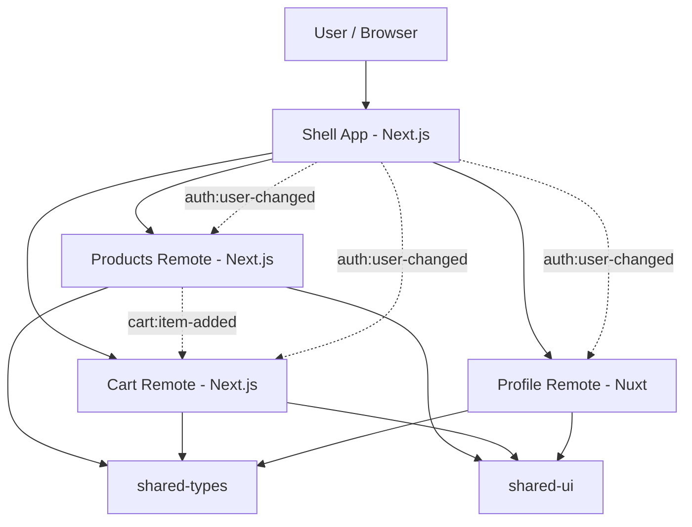

# Commerce Portal Micro Frontend

This repository is a micro frontend learning demo built around a `monorepo + domain boundaries + runtime composition mindset`.

The project uses:

- `Next.js` for `shell`, `products`, and `cart`
- `Nuxt 3` for `profile`
- `TypeScript` for shared contracts
- `npm workspaces` for monorepo management

The main goal of this repo is to learn the core ideas behind micro frontends:

- split by `business domain`
- separate `ownership` across apps
- keep the `shell` focused on orchestration
- prepare for `runtime composition` and cross-app communication through event contracts

## Stack

- Node.js: `>= 20`
- Package manager: `npm`
- Monorepo: `npm workspaces`
- Host app: `Next.js 16`
- Remote apps:
  - `products`: `Next.js 16`
  - `cart`: `Next.js 16`
  - `profile`: `Nuxt 3.12.4`
- Shared packages:
  - `@commerce/shared-types`
  - `@commerce/shared-ui`

## Repository Structure

```text
apps/
  shell/         # host app, layout, top nav, route orchestration
  products/      # products domain
  cart/          # cart domain
  profile/       # profile domain (Nuxt)
packages/
  shared-types/  # shared cross-app contracts
  shared-ui/     # shared UI primitives
```

## Installation

Requirements:

- `Node.js >= 20`
- `npm >= 10` is the safest choice for the current workspace setup

Install dependencies from the repository root:

```bash
npm install
```

## Running Each App

### 1. Run the shell

```bash
npm run dev:shell
```

- URL: `http://localhost:3000`
- Role: the main user entrypoint, responsible for layout, top navigation, and route skeletons

### 2. Run products

```bash
npm run dev:products
```

- URL: `http://localhost:3001`
- Role: the catalog domain, rendering a mock product list

### 3. Run cart

```bash
npm run dev:cart
```

- URL: `http://localhost:3002`
- Role: the cart domain, rendering badge state, line items, and a mock subtotal

### 4. Run profile

```bash
npm run dev:profile
```

- URL: `http://localhost:3003`
- Role: the user account domain built with `Nuxt`

Notes:

- Run each app in a separate terminal if you want them active at the same time.
- `npm run dev` at the root currently starts only the `shell`.

## Build And Typecheck

Build each app:

```bash
npm run build:shell
npm run build:products
npm run build:cart
npm run build:profile
```

Build the whole workspace:

```bash
npm run build
```

Typecheck per app:

```bash
npm run typecheck:shell
npm run typecheck:products
npm run typecheck:cart
npm run typecheck:profile
```

## Domain Boundaries

This is the most important part of the repository.

### Shell

The `shell` is the only host app that users should enter directly.

The shell should keep:

- global layout
- top navigation
- route orchestration
- auth context handoff
- host-level fallback UI and error boundaries

The shell should not keep:

- products business rules
- cart calculation logic
- profile-specific data management

### Products

`products` should only own:

- product discovery
- catalog UI
- product card rendering
- event trigger points such as `cart:item-added`

`products` should not know about:

- cart subtotal
- profile state
- shell layout internals

### Cart

`cart` should only own:

- badge count
- line items
- subtotal or cart summary
- consuming events from other domains through clear contracts

`cart` should not:

- import business logic directly from `products`
- depend on how the shell renders layout

### Profile

`profile` should only own:

- account overview
- user information
- account-specific settings or activity

`profile` should not:

- contain products or cart logic
- import code directly from another remote

### Shared Packages

`packages/shared-types`

- is the single source of truth for cross-app contracts
- currently contains types such as `User`, `Product`, `CartItem`, and `MicroAppEventMap`

`packages/shared-ui`

- should contain only UI and layout primitives
- should not contain business logic
- is still a placeholder and will be expanded in the next steps

### Default Rules

- `remote -> remote direct import`: not allowed
- `remote -> shared/*`: allowed
- `remote -> shell`: only through event contracts or a very small host API

## Overall Architecture

### Mental Model

```text
User
  |
  v
Shell App (Next.js)
  - layout
  - navigation
  - route orchestration
  - auth handoff
  |
  +--> Products Remote (Next.js)
  +--> Cart Remote (Next.js)
  +--> Profile Remote (Nuxt)

Shared layer:
  - @commerce/shared-types
  - @commerce/shared-ui

Event contracts:
  - products -> cart: cart:item-added
  - shell -> remotes: auth:user-changed
```

### Mermaid Diagram



## Current Repository Status

Already in place:

- monorepo structure with `apps/*` and `packages/*`
- `shell` built with `Next.js`
- `products` built with `Next.js`
- `cart` built with `Next.js`
- `profile` built with `Nuxt`
- `shared-types` with the initial contracts
- `shared-ui` placeholder

Not finished yet:

- real runtime composition between host and remotes
- lazy loading for remotes
- real event-driven communication between `products` and `cart`
- complete error isolation and fallback UI
- smoke tests and integration tests

In short: the repo already has the right boundaries and skeleton, and the next step is to connect the apps using proper micro frontend patterns.

## Nuxt Remote Note

`apps/profile` is currently pinned to `Nuxt 3.12.4` for better stability with the current Node environment.

The repo also includes:

- `apps/profile/scripts/run-nuxi.mjs`

This script helps run `nuxi` more reliably in the current workspace setup.
