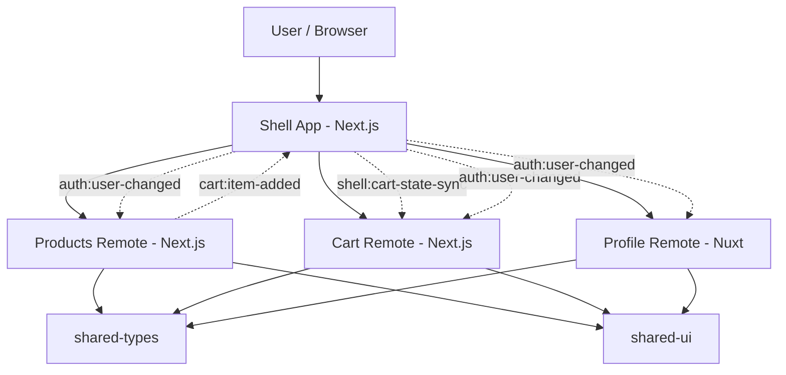

# HF Commerce Portal

A sneaker-commerce portfolio project and learning-focused micro frontend demo. It uses a `monorepo + domain boundaries + runtime composition` approach to show how independently buildable frontend domains can still feel like one product.

## What This Repository Demonstrates

- a single `shell` as the user entrypoint
- independently runnable frontend domains
- cross-app communication through typed contracts
- runtime composition between `Next.js` and `Nuxt`
- remote failure isolation and fallback behavior
- style isolation through `iframe` boundaries and a shared Tailwind CSS design system
- repository-level smoke and integration checks for the core architecture

## Why Micro Frontend For This Demo?

This demo uses micro frontend ideas because the target problem is not “how to split components,” but “how to split ownership.”

The `Commerce Portal` shape makes that visible:

- `shell` owns navigation, routing, host-level fallback UI, and auth handoff
- `products` owns discovery and emits add-to-cart intent
- `cart` owns cart presentation and consumes shell-synced snapshots
- `profile` owns account-facing pages in a different framework

This is a good fit for micro frontend learning because it demonstrates three realistic pressures:

- different teams can own different business domains
- each domain can stay independently runnable and buildable
- a larger system can migrate gradually instead of rewriting one giant frontend at once

It is not a good fit for every project. If the app is still small, the team is small, or releases do not need domain-level independence, a monolith or a modular frontend is usually the better trade-off.

## Stack

- Node.js: `>= 20`
- Package manager: `npm`
- Monorepo: `npm workspaces`
- Shell: `Next.js 16`
- Remotes:
  - `products`: `Next.js 16`
  - `cart`: `Next.js 16`
  - `profile`: `Nuxt 3.12.4`
- Shared packages:
  - `@commerce/shared-types`
  - `@commerce/shared-ui`
- Test approach:
  - Node-based smoke and integration check scripts

## Repository Structure

```text
apps/
  shell/         # host app, layout, nav, runtime orchestration
  products/      # products domain
  cart/          # cart domain
  profile/       # profile domain (Nuxt)
packages/
  shared-types/  # typed cross-app contracts
  shared-ui/     # shared tokens and UI primitives
scripts/
  check-boundaries.mjs
tests/
  smoke/
  integration/
```

## Installation

```bash
npm install
```

## Quick Start

Run these commands in four terminal windows. The shell is the only user-facing entrypoint; it loads the domain apps on demand.

```bash
npm run dev:shell
npm run dev:products
npm run dev:cart
npm run dev:profile
```

Then open `http://localhost:3000`. Use the shell navigation to visit Products, Cart, and Profile.

## Standalone Development

You can also open each domain directly while developing:

Runtime URLs:

- shell: `http://localhost:3000`
- products: `http://localhost:3001`
- cart: `http://localhost:3002`
- profile: `http://localhost:3003`

The individual URLs are useful for local development and standalone verification. In the intended portal experience, users enter through the shell at `http://localhost:3000`.

## Portfolio Screens

Screenshots for the four main routes belong in [`docs/screenshots`](docs/screenshots/README.md). This keeps visual evidence separate from application code and makes it easy to embed the latest captures in this README.

| Screen   | Shell route | Asset name       |
| -------- | ----------- | ---------------- |
| Home     | `/`         | `shell-home.png` |
| Products | `/products` | `products.png`   |
| Cart     | `/cart`     | `cart.png`       |
| Profile  | `/profile`  | `profile.png`    |

## Test, Build, And Validation

```bash
npm run test
npm run test:smoke
npm run test:integration
npm run check:boundaries
npm run build:shell
npm run build:products
npm run build:cart
npm run build:profile
npm run validate
```

What each validation layer covers:

- `test:smoke`: verifies standalone scripts, route entrypoints, and shared package surfaces exist where the architecture expects them
- `test:integration`: verifies typed envelopes, route mapping helpers, auth handoff contracts, and the `products -> shell -> cart` add-to-cart flow at the contract level
- `check:boundaries`: fails if one app imports source code directly from another app
- `validate`: runs tests, boundary checks, and independent builds for all four apps

## Runtime Composition Strategy

This repository currently uses `route-level runtime composition` with `iframe` surfaces.

Why this approach right now:

- it keeps each domain independently runnable
- it works cleanly across `Next.js` and `Nuxt`
- it makes host vs remote boundaries obvious
- it lets the project focus on contracts, failure isolation, and communication before moving into bundler-level federation complexity

Current runtime model:

- `shell` owns navigation and shell routes such as `/products`, `/cart`, and `/profile`
- each remote still runs on its own origin
- the shell maps host routes to remote origins and loads them at runtime
- cross-app messages use `postMessage` and typed envelopes from `@commerce/shared-types`

## Architecture

### Mental Model

```text
User
  |
  v
Shell App (Next.js)
  - layout
  - navigation
  - route orchestration
  - auth handoff
  - fallback UI
  |
  +--> Products Remote (Next.js)
  +--> Cart Remote (Next.js)
  +--> Profile Remote (Nuxt)

Shared layer:
  - @commerce/shared-types
  - @commerce/shared-ui
```

### Event Flow

```text
products -> shell: cart:item-added
shell -> cart: shell:cart-state-sync
shell -> remotes: auth:user-changed
```

### Mermaid Diagram



## Boundaries And Communication Rules

### Shell owns

- layout
- top navigation
- route orchestration
- auth context handoff
- host-level fallback UI
- host-side error boundaries
- cart snapshot storage at the shell boundary

### Products owns

- product discovery
- product cards
- the `cart:item-added` producer contract

### Cart owns

- cart presentation
- line items
- subtotal and count rendering
- consuming shell-synced cart snapshots

### Profile owns

- account overview
- profile pages and settings
- consuming shell auth context

### Shared packages own

`@commerce/shared-types`

- `User`
- `Product`
- `CartItem`
- event payloads
- runtime envelopes
- message names and event names

`@commerce/shared-ui`

- design tokens
- shared primitives such as `ui-section`, `ui-card`, `ui-button`, and `ui-copy`
- framework-agnostic CSS only

### Rules

- `remote -> remote direct import`: not allowed
- `remote -> shared/*`: allowed
- `remote -> shell`: only through event contracts or a very small host API surface
- `shell -> remote business code`: not used in the current route-level composition strategy

## Style Isolation Strategy

There are two style boundaries in the current setup.

### 1. Runtime boundary

Each remote is loaded through an `iframe`, so styles from one remote do not leak into another remote at runtime.

### 2. Domain boundary

All apps consume the same Tailwind-powered CSS entrypoint from `@commerce/shared-ui`. Shared `hf-*` utility classes and semantic tokens define the visual language, while each domain keeps its own components and business layout decisions.

That means:

- shared visual primitives stay global and reusable
- domain components retain ownership of their layout and behavior
- the repo is safer if one remote is later rendered without an iframe

## Problems Faced And How They Were Handled

### Cross-framework composition pressure

- problem: `shell` is `Next.js` while `profile` is `Nuxt`, so forcing bundler-level federation too early would add noise before the core boundary lessons were clear
- response: use route-level runtime composition first, then keep `profile` independently runnable on its own origin

### Remote outage resilience

- problem: a remote failure should not take down the whole portal
- response: the shell uses timeout-based fallback UI, a route-level outage drill, and host-side error boundaries

### Style consistency risk

- problem: independently owned apps can drift into separate visual languages
- response: use the shared Tailwind CSS entrypoint and the `@commerce/shared-ui` primitives while keeping business UI inside its owning domain

### Boundary drift

- problem: architecture rules become documentation-only unless the repo can enforce them
- response: add `npm run check:boundaries` to fail fast when one app imports source from another app directly

### Contract drift

- problem: hardcoded event strings and payload assumptions create silent coupling
- response: centralize event names, payload types, envelopes, and guards in `@commerce/shared-types`, then add node-based integration checks around that flow
