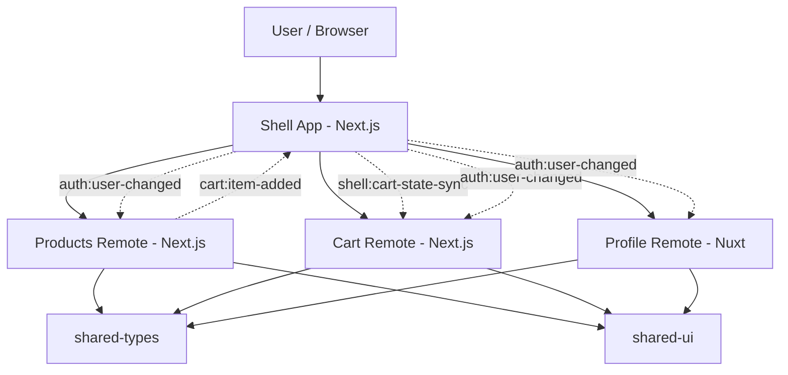

# Commerce Portal Micro Frontend

A learning-focused micro frontend demo built with a `monorepo + domain boundaries + runtime composition` mindset.

## What This Repository Demonstrates

- a single `shell` as the user entrypoint
- independently runnable frontend domains
- cross-app communication through typed contracts
- runtime composition between `Next.js` and `Nuxt`
- remote failure isolation and fallback behavior
- style isolation through `iframe` boundaries plus CSS Modules inside remotes
- repository-level smoke and integration checks for the core architecture

## Why Micro Frontend For This Demo?

This demo uses micro frontend ideas because the target problem is not “how to split components,” but “how to split ownership.”

The `Commerce Portal` shape makes that visible:

- `shell` owns navigation, routing, host-level fallback UI, and auth handoff
- `products` owns discovery and emits add-to-cart intent
- `cart` owns cart presentation and consumes shell-synced snapshots
- `profile` owns account-facing pages in a different framework

This is a good fit for micro frontend learning because it demonstrates three realistic pressures:

- different teams can own different business domains
- each domain can stay independently runnable and buildable
- a larger system can migrate gradually instead of rewriting one giant frontend at once

It is not a good fit for every project. If the app is still small, the team is small, or releases do not need domain-level independence, a monolith or a modular frontend is usually the better trade-off.

## Stack

- Node.js: `>= 20`
- Package manager: `npm`
- Monorepo: `npm workspaces`
- Shell: `Next.js 16`
- Remotes:
  - `products`: `Next.js 16`
  - `cart`: `Next.js 16`
  - `profile`: `Nuxt 3.12.4`
- Shared packages:
  - `@commerce/shared-types`
  - `@commerce/shared-ui`
- Test approach:
  - Node-based smoke and integration check scripts

## Repository Structure

```text
apps/
  shell/         # host app, layout, nav, runtime orchestration
  products/      # products domain
  cart/          # cart domain
  profile/       # profile domain (Nuxt)
packages/
  shared-types/  # typed cross-app contracts
  shared-ui/     # shared tokens and UI primitives
scripts/
  check-boundaries.mjs
tests/
  smoke/
  integration/
```

## Installation

```bash
npm install
```

## Run The Apps

```bash
npm run dev:shell
npm run dev:products
npm run dev:cart
npm run dev:profile
```

Runtime URLs:

- shell: `http://localhost:3000`
- products: `http://localhost:3001`
- cart: `http://localhost:3002`
- profile: `http://localhost:3003`

## Test, Build, And Validation

```bash
npm run test
npm run test:smoke
npm run test:integration
npm run check:boundaries
npm run build:shell
npm run build:products
npm run build:cart
npm run build:profile
npm run validate
```

What each validation layer covers:

- `test:smoke`: verifies standalone scripts, route entrypoints, and shared package surfaces exist where the architecture expects them
- `test:integration`: verifies typed envelopes, route mapping helpers, auth handoff contracts, and the `products -> shell -> cart` add-to-cart flow at the contract level
- `check:boundaries`: fails if one app imports source code directly from another app
- `validate`: runs tests, boundary checks, and independent builds for all four apps

## Runtime Composition Strategy

This repository currently uses `route-level runtime composition` with `iframe` surfaces.

Why this approach right now:

- it keeps each domain independently runnable
- it works cleanly across `Next.js` and `Nuxt`
- it makes host vs remote boundaries obvious
- it lets the project focus on contracts, failure isolation, and communication before moving into bundler-level federation complexity

Current runtime model:

- `shell` owns navigation and shell routes such as `/products`, `/cart`, and `/profile`
- each remote still runs on its own origin
- the shell maps host routes to remote origins and loads them at runtime
- cross-app messages use `postMessage` and typed envelopes from `@commerce/shared-types`

## Architecture

### Mental Model

```text
User
  |
  v
Shell App (Next.js)
  - layout
  - navigation
  - route orchestration
  - auth handoff
  - fallback UI
  |
  +--> Products Remote (Next.js)
  +--> Cart Remote (Next.js)
  +--> Profile Remote (Nuxt)

Shared layer:
  - @commerce/shared-types
  - @commerce/shared-ui
```

### Event Flow

```text
products -> shell: cart:item-added
shell -> cart: shell:cart-state-sync
shell -> remotes: auth:user-changed
```

### Mermaid Diagram



## Boundaries And Communication Rules

### Shell owns

- layout
- top navigation
- route orchestration
- auth context handoff
- host-level fallback UI
- host-side error boundaries
- cart snapshot storage at the shell boundary

### Products owns

- product discovery
- product cards
- the `cart:item-added` producer contract

### Cart owns

- cart presentation
- line items
- subtotal and count rendering
- consuming shell-synced cart snapshots

### Profile owns

- account overview
- profile pages and settings
- consuming shell auth context

### Shared packages own

`@commerce/shared-types`

- `User`
- `Product`
- `CartItem`
- event payloads
- runtime envelopes
- message names and event names

`@commerce/shared-ui`

- design tokens
- shared primitives such as `ui-section`, `ui-card`, `ui-button`, and `ui-copy`
- framework-agnostic CSS only

### Rules

- `remote -> remote direct import`: not allowed
- `remote -> shared/*`: allowed
- `remote -> shell`: only through event contracts or a very small host API surface
- `shell -> remote business code`: not used in the current route-level composition strategy

## Style Isolation Strategy

There are two style boundaries in the current setup.

### 1. Runtime boundary

Each remote is loaded through an `iframe`, so styles from one remote do not leak into another remote at runtime.

### 2. Domain boundary

Inside `products` and `cart`, domain-specific layout classes live in CSS Modules instead of broad global selectors.

That means:

- shared tokens stay global and reusable
- domain-specific selectors stay scoped
- the repo is safer if one remote is later rendered without an iframe

## Problems Faced And How They Were Handled

### Cross-framework composition pressure

- problem: `shell` is `Next.js` while `profile` is `Nuxt`, so forcing bundler-level federation too early would add noise before the core boundary lessons were clear
- response: use route-level runtime composition first, then keep `profile` independently runnable on its own origin

### Remote outage resilience

- problem: a remote failure should not take down the whole portal
- response: the shell uses timeout-based fallback UI, a route-level outage drill, and host-side error boundaries

### Style leakage risk

- problem: even with `iframe` isolation, broad selectors inside remotes make future composition changes riskier
- response: move domain-specific layout classes into CSS Modules and keep shared primitives in `@commerce/shared-ui`

### Boundary drift

- problem: architecture rules become documentation-only unless the repo can enforce them
- response: add `npm run check:boundaries` to fail fast when one app imports source from another app directly

### Contract drift

- problem: hardcoded event strings and payload assumptions create silent coupling
- response: centralize event names, payload types, envelopes, and guards in `@commerce/shared-types`, then add node-based integration checks around that flow

## Shared Package Versioning Note

Right now the shared packages live inside one workspace and move in lockstep with the apps.

That is fine for a learning repo, but a production setup would usually add stronger versioning discipline such as:

- explicit semver for `shared-types` and `shared-ui`
- contract change notes for any event or payload updates
- compatibility rules for host and remotes during rolling deployments
- CI checks that block breaking shared-contract changes unless all dependent apps are updated

## Day 22-25 Highlights

### Day 22: smoke tests

- added lightweight Node-based smoke coverage for app scripts, route entrypoints, and shared package surfaces
- kept the tests lightweight so they reinforce architecture without dragging in a full browser stack too early

### Day 23: integration tests

- added contract-level integration checks for typed envelopes
- verified the `products -> shell -> cart` flow through shared contracts and shell runtime helpers
- verified route builders and auth handoff envelopes stay aligned with shared event names

### Day 24: build and validation workflow

- added root scripts for `test`, `test:smoke`, `test:integration`, and `validate`
- updated the Nuxt wrapper so `profile` build and type tooling run more reliably in this workspace
- kept per-app build scripts as first-class commands for independent module ownership

### Day 25: production-thinking documentation

- documented why micro frontend makes sense here
- documented the main problems already encountered and the trade-offs behind the current composition strategy
- added a clear “what I would do differently in production” section instead of pretending the demo is already production-perfect

## What I Would Do Differently In A Production Setup

- move from `iframe`-first composition to a more deliberate runtime integration strategy once framework and hosting constraints are clear
- add real observability: remote load metrics, structured error reporting, and correlation across host and remotes
- version `shared-types` and `shared-ui` as publishable contracts instead of workspace-only packages
- add browser-driven integration or E2E checks for route loading, deep links, badge updates, and fallback UX
- introduce remote manifests, caching policy, and deployment metadata so host and remotes can roll out independently with safer compatibility checks
- tighten auth, session, and permission boundaries instead of relying on a lightweight demo handoff

## Current Status

Completed through Day 25:

- shell + 3 remotes created
- typed contracts in `shared-types`
- shared primitives in `shared-ui`
- route-level runtime composition in the shell
- typed products-to-shell event flow
- shell-to-cart snapshot sync
- lazy loading for remote surfaces
- shell-side fallback UI and error boundaries
- simulated cart remote outage flow
- CSS Module scoping for domain-specific styles in `products` and `cart`
- README architecture, production notes, and boundary documentation
- import boundary check script
- node-based smoke tests and integration tests
- root validation workflow for tests + boundaries + independent builds

Next likely steps:

- screenshots or GIF demo for the portfolio README
- browser-driven route verification and badge-update E2E coverage
- CV bullets and a STAR interview story
- a future experiment with real Module Federation once the cross-framework constraints are intentionally chosen

## Nuxt Remote Note

`apps/profile` stays pinned to `Nuxt 3.12.4` in this workspace for stability with the current local environment.