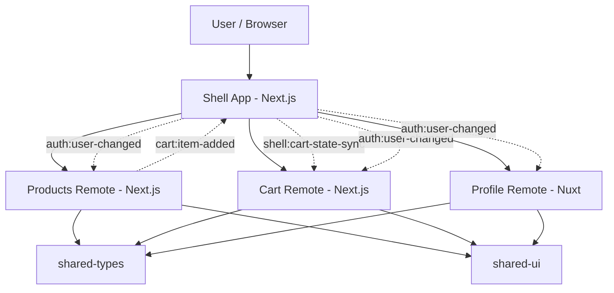

# Commerce Portal Micro Frontend

A learning-focused micro frontend demo built with a `monorepo + domain boundaries + runtime composition` mindset.

## What This Repository Demonstrates

- a single `shell` as the user entrypoint
- independently runnable frontend domains
- cross-app communication through typed contracts
- runtime composition between `Next.js` and `Nuxt`
- remote failure isolation and fallback behavior
- style isolation through `iframe` boundaries plus CSS Modules inside remotes

## Stack

- Node.js: `>= 20`
- Package manager: `npm`
- Monorepo: `npm workspaces`
- Shell: `Next.js 16`
- Remotes:
  - `products`: `Next.js 16`
  - `cart`: `Next.js 16`
  - `profile`: `Nuxt 3.12.4`
- Shared packages:
  - `@commerce/shared-types`
  - `@commerce/shared-ui`

## Repository Structure

```text
apps/
  shell/         # host app, layout, nav, runtime orchestration
  products/      # products domain
  cart/          # cart domain
  profile/       # profile domain (Nuxt)
packages/
  shared-types/  # typed cross-app contracts
  shared-ui/     # shared tokens and UI primitives
scripts/
  check-boundaries.mjs
```

## Installation

```bash
npm install
```

## Run The Apps

```bash
npm run dev:shell
npm run dev:products
npm run dev:cart
npm run dev:profile
```

Runtime URLs:

- shell: `http://localhost:3000`
- products: `http://localhost:3001`
- cart: `http://localhost:3002`
- profile: `http://localhost:3003`

## Build And Validation

```bash
npm run build:shell
npm run build:products
npm run build:cart
npm run build:profile

npm run typecheck:shell
npm run typecheck:products
npm run typecheck:cart
npm run check:boundaries
```

Notes:

- `shell`, `products`, and `cart` typecheck successfully.
- `profile` builds successfully in the current workspace setup.
- `check:boundaries` fails if one app imports code directly from another app.

## Runtime Composition Strategy

This repository currently uses `route-level runtime composition` with `iframe` surfaces.

Why this approach right now:

- it keeps each domain independently runnable
- it works cleanly across `Next.js` and `Nuxt`
- it makes host vs remote boundaries obvious
- it lets the project focus on contracts, failure isolation, and communication before moving into bundler-level federation complexity

Current runtime model:

- `shell` owns navigation and shell routes such as `/products`, `/cart`, and `/profile`
- each remote still runs on its own origin
- the shell maps host routes to remote origins and loads them at runtime
- cross-app messages use `postMessage` and typed envelopes from `@commerce/shared-types`

## Architecture

### Mental Model

```text
User
  |
  v
Shell App (Next.js)
  - layout
  - navigation
  - route orchestration
  - auth handoff
  - fallback UI
  |
  +--> Products Remote (Next.js)
  +--> Cart Remote (Next.js)
  +--> Profile Remote (Nuxt)

Shared layer:
  - @commerce/shared-types
  - @commerce/shared-ui
```

### Event Flow

```text
products -> shell: cart:item-added
shell -> cart: shell:cart-state-sync
shell -> remotes: auth:user-changed
```

### Mermaid Diagram



## Boundaries And Communication Rules

### Shell owns

- layout
- top navigation
- route orchestration
- auth context handoff
- host-level fallback UI
- host-side error boundaries
- cart snapshot storage at the shell boundary

### Products owns

- product discovery
- product cards
- the `cart:item-added` producer contract

### Cart owns

- cart presentation
- line items
- subtotal and count rendering
- consuming shell-synced cart snapshots

### Profile owns

- account overview
- profile pages and settings
- consuming shell auth context

### Shared packages own

`@commerce/shared-types`

- `User`
- `Product`
- `CartItem`
- event payloads
- runtime envelopes
- message names and event names

`@commerce/shared-ui`

- design tokens
- shared primitives such as `ui-section`, `ui-card`, `ui-button`, and `ui-copy`
- framework-agnostic CSS only

### Rules

- `remote -> remote direct import`: not allowed
- `remote -> shared/*`: allowed
- `remote -> shell`: only through event contracts or a very small host API surface
- `shell -> remote business code`: not used in the current route-level composition strategy

## Style Isolation Strategy

There are two style boundaries in the current setup.

### 1. Runtime boundary

Each remote is loaded through an `iframe`, so styles from one remote do not leak into another remote at runtime.

### 2. Domain boundary

Inside `products` and `cart`, domain-specific layout classes now live in CSS Modules instead of broad global selectors.

That means:

- shared tokens stay global and reusable
- domain-specific selectors stay scoped
- the repo is safer if one remote is later rendered without an iframe

## Day 19-21 Highlights

### Day 19: remote outage drill

Use this host route to simulate a cart outage:

```text
http://localhost:3000/cart?simulate=cart-outage
```

What happens:

- the shell points the cart iframe to an unavailable origin
- the cart surface times out
- the shell shows fallback UI instead of crashing
- the rest of the portal remains usable

### Day 20: style conflict prevention

- `products` page and catalog styles use CSS Modules
- `cart` runtime view uses CSS Modules
- shared primitives remain in `@commerce/shared-ui`

### Day 21: explicit boundary checks

Run:

```bash
npm run check:boundaries
```

This verifies that one app is not importing source code directly from another app.

## Current Status

Completed through Day 21:

- shell + 3 remotes created
- typed contracts in `shared-types`
- shared primitives in `shared-ui`
- route-level runtime composition in the shell
- typed products-to-shell event flow
- shell-to-cart snapshot sync
- lazy loading for remote surfaces
- shell-side fallback UI and error boundaries
- simulated cart remote outage flow
- CSS Module scoping for domain-specific styles in `products` and `cart`
- README architecture and boundary documentation
- import boundary check script

Next likely steps:

- smoke tests per app
- host integration tests
- screenshots or GIF demo
- production-thinking notes and CV bullets

## Nuxt Remote Note

`apps/profile` stays pinned to `Nuxt 3.12.4` in this workspace for stability with the current local environment.